# Loop Engine — 流水线编排引擎

> Pipeline Orchestration Engine — 把复杂工作流拆成阶段、门禁、循环的标准模板

## 概述

Loop Engine 是一个**流水线编排引擎**——它通过结构化对话引导你一步步设计出流水线配置（YAML），从执行模式选择到阶段编排到门禁校验到循环条件，全部在对话中完成。Prompt 模板定义了整个对话该怎么走、该问什么、怎么判断；YAML schema 定义了最终产出的配置长什么样。设计完成后，你可以选择立即执行或保存为可复用的 Skill。

**核心理念：** 让非确定性模型对复杂、高价值任务的执行变得可重复、可追踪、有纪律。

## 逻辑结构图



## 设计取向

这份技能是 **Prompt 模板**，是设计独立调度系统的指南和引导——所有约束、上限、纪律最终都靠执行它的模型自觉兑现。文档措辞始终让模型对自己负责，而非误以为有外部机制兜底。

## 三种执行模式

| 模式 | 说明 | 适用场景 |
|:----|:-----|:---------|
| **串行 sequential** | 步骤依次执行 | 步骤之间有明确前后依赖 |
| **并行 parallel** | 所有步骤同时启动 | 多个独立任务互不依赖 |
| **混合 mixed** | 组间串行、组内并行 | 第一步并行采集，第二步串行汇总 |

```text
🔵 串行 sequential：
   step-1 ──→ [gate] ──→ step-2 ──→ generate

🟢 并行 parallel：
   task-A ──┐
   task-B ──┤──→ merge ──→ generate
   task-C ──┘

🟠 混合 mixed：
   g1（并行）──→ [gate] ──→ g2（串行）──→ generate
```

### 两种循环机制

```text
① 正常流向（流水线主线）：
   step-1 ──→ [gate] ──→ step-2 ──→ generate

② 内循环 local_retry（当前阶段内部重试，输入不变）：
   step-1 ──→ [gate] ──→ step-2 ──→ ✓成功 ──→ generate
                              ↑          │
                              └── retry ──┘
                              ×N，输入不变

③ 外循环 loop（gate不通过，携带反馈回到前置阶段）：

   正常通过：step-1 ──→ [gate] ──→ step-2 ──→ generate

   不通过循环：step-1 ←──────────────── [gate]
                    ↑                       │
                    │                       │  ✗不通过
                    │                       │  携带未通过项 + 已尝试调整
                    └───────────────────────┘
                    （回到 step-1 重新执行）
```

## 核心组件

```
Phase（阶段）→ Gate（门禁）→ Loop（循环）→ Generate（输出）
```

### Phase 类型
- **skill** — 调用另一个技能
- **custom** — 执行自定义指令
- **gate** — 质量门禁（必须用独立 subagent 校验，不得自判）
- **merge** — 合并多个并行输出
- **generate** — 生成最终产物（html/markdown/json）

### 内循环 vs 外循环
- **local_retry** — 当前阶段原地重试（输入不变，应对临时错误）
- **loop** — 回到前置阶段（必须携带上一轮失败反馈）

## 关键设计纪律

- **门禁独立性** — gate 必须以独立 subagent 执行，不得在同一推理链条中既执行任务又打分
- **防执行幻觉** — 由你亲自执行，没有外部引擎替你计时计数
- **循环反馈** — 每次循环必须携带上一轮的具体未通过项 + 已尝试调整
- **结构性失败判断** — 数据源不存在等不可恢复问题不应浪费循环预算
- **best_of 收敛** — 不默认"最后一轮最好"，维护 best-so-far 指针
- **double_check** — 只防噪声（偶发判断波动），不防偏差（标准本身系统性偏松）

## 数据模式

| 模式 | 行为 |
|:----|:------|
| `overwrite` | 循环时覆盖前一轮输出 |
| `accumulate` | 保留各轮输出，按迭代号归档 |
| `ask` | 询问用户如何处理 |
| `best_of` | 交付 best-so-far 指向的那一轮（推荐） |

## 使用方式

1. 定义流水线：编写 YAML 配置（mode / phases / groups / loops / goal）
2. 展示配置给用户确认
3. 选择立即执行或持久化为 Skill
4. 按 10 步标准执行流程运行
5. 输出执行报告

## 最佳实践

- 门禁的 check_list 必须具体可操作，拒绝"看看质量怎么样"这类模糊措辞
- parallel 和 pipeline 的组合中，注意跨组回退会触发整组重跑
- goal（目标）、constraints（约束）、verification（验收）三要素驱动闭环
- 执行报告需逐条说明 pipeline notes 和 phase notes 的遵守情况
- 善用 `best_of` 数据模式，不要假设最后一轮一定最好

## 已知局限

1. 这是 prompt 模板——所有"硬上限"靠模型自觉，无外部强制机制
2. `double_check` 只能降低噪声，不能纠正偏差（同一个 check skill 的系统性弱点，跑两次大概率还是错在同一个地方）
3. `best_of` 依赖 gate 能输出可比较的程度信息，若 gate 只输出二元通过/不通过，退化为"最近一次未通过的结果"
4. `partial_retry` 在单 phase→gate 场景中等价于无效果，它真正发挥作用的场景是 merge 后的多源 gate

## 循环工程 vs 流水线

经常有人问"循环工程（Loop Engineering）和流水线（Pipeline）有什么区别"——这是一个很好的问题，理解两者的关系是用好这份技能的前提。

### 核心区别

| | 循环工程 (Loop Engineering) | 流水线 (Pipeline) |
|:----|:----|:----|
| **本质** | 方法论 / 框架 | 具体配置实例 |
| **回答什么** | "怎么设计带纠错机制的自动化流程" | "这条流程具体分几步、怎么走" |
| **包含** | 阶段、门禁、内/外循环、收敛判断、终止优先级、数据模式…… | phases → gates → generate 的排列组合 |
| **有没有"学习能力"** | ✅ 有——反馈回路 + best-of 收敛 | ❌ 传统流水线没有，只是线性步骤 |

### 更直白的类比

- **循环工程 = 交通系统设计规范**（红绿灯怎么设、事故怎么处理、拥堵怎么疏导）
- **流水线 = 一条具体的路**（从A到B几个路口、限速多少）

### 三条传统流水线没有的东西

纯流水线（比如 GitHub Actions、CI/CD pipeline）是 **一次性的前向流程**：A → B → C → 完成。错了从头再来，没有"记忆"。

循环工程在流水线之上加了三个关键机制：

1. **门禁（Gate）** — 不是"跑完检查一下"，而是用 **独立 subagent** 做校验，和主流程隔离，避免自己执行自己打分的幻觉问题
2. **带反馈的循环（Loop）** — 不达标时带着"哪里错了 + 之前试过什么"回到前面重做，不是蒙着眼睛再试一次
3. **best-so-far 收敛** — 循环终止时交付最优轮的结果，不默认"最后一轮最好"

### 一句话总结

> **每条循环工程配置出来都包含一条流水线，但不是每条流水线都能叫循环工程——只有那些带独立门禁、带反馈回路、知道"哪轮最好"的才算。**

另见：[dynamic-workflow-automation](https://github.com/qscq2026/dynamic-workflow-automation/)

---

## 附：与 Loop Engineering / Boris Loop 的关系

### 理论源头

2026 年 6 月，Claude Code 创建者 **Boris Cherny** 在 Meta @Scale 大会上宣告了一个新范式：**"我不再给 Claude 写提示词了。是循环在跑，它们提示 Claude、自己琢磨该干什么。我的工作就是写循环。"**

他描述了三层架构（The Hive）：

| 层级 | 名称 | 行为 |
|:----|:-----|:------|
| Layer 1 | 本地 `/loop` | 时间驱动循环，关电脑停 |
| Layer 2 | 云端 Routines | cron 驱动，关电脑不停 |
| Layer 3 | `/batch` + 动态 Workflow | 大规模 worktree agent 并行 |

同时，Google 工程师 **Addy Osmani** 系统化地提出了 **Loop Engineering** 框架，将 Boris 的实践提炼为 6 个构建模块：Automations、Worktrees、Skills、Connectors、Sub-agents、Memory。

### Loop Engine 在其中的定位

Loop Engine 是独立于 Boris 三层架构之外的完整系统——它不产出可被其他工具消费的产物，而是产出供当前模型直接执行的 YAML 配置：

```
传统流程：
  ┌────────────────┐     ┌──────────────────────┐
  │ 模糊需求         │ →   │ 直接执行（或编写脚本） │
  └────────────────┘     └──────────────────────┘

加入 Loop Engine 后的流程：
  ┌────────────────┐     ┌──────────────────┐     ┌──────────────────────┐
  │ 模糊需求         │ →   │ Loop Engine       │ →   │ 模型执行 YAML       │
  │                 │     │ 设计 YAML 配置     │     │（各阶段 → 门禁 →    │
  │                 │     │ + 确认 + 持久化    │     │  循环 → 生成报告）   │
  └────────────────┘     └──────────────────┘     └──────────────────────┘
                               │
                               ├── Gate → 对应 Boris 的**写查分离**（独立 subagent 评估，不自我打分）
                               └── Loop → 对应 Boris 的**递归式终止**思想（带反馈的迭代，不是空转）
```

### 直接对应关系

| Loop Engine 概念 | 对应的 Boris / Loop Engineering 概念 | 说明 |
|:----------------|:-----------------------------------|:-----|
| **Gate（独立 subagent 校验）** | 写查分离（Generator/Evaluator Separation） | Boris 指出三大陷阱（偷懒/自夸/漂移）；Loop Engine 的 Gate 通过独立 subagent 结构性解决，而非靠纪律约束 |
| **外循环 Loop（带反馈回退）** | 递归式终止（Recursive Termination）+ 三层飞轮 | Boris 的循环由子 agent 判断"是否完成"；Loop Engine 的外循环携带"失败了什么 + 试过什么"回到前置阶段，在 feedback 机制上与 Boris 同构 |
| **内循环 local_retry** | —（Boris 未单独区分） | Loop Engine 特有的双重粒度——临时错误原地重试 vs 质量问题回退重做 |
| **best_of 收敛** | —（Boris 未显式对应） | Loop Engine 特有：不默认"最后一轮最好"，维护 best-so-far 指针 |
| **数据模式（overwrite/accumulate/best_of）** | 文件系统层间通信 | Boris 的层间通过写文件通信；Loop Engine 的 data_mode 定义了同一层内的迭代数据管理 |
| **double_check** | Evaluator 方差意识 | Boris 的系统用独立小模型做 evaluation；Loop Engine 明确指出"同一个模型跑两次只防噪声不防偏差" |
| **防执行幻觉纪律** | —（Boris 的工作基于 Claude Code 产品内置的 auto-mode，不依赖模型自觉） | Loop Engine 因是 prompt 模板而非产品，必须靠显式纪律补偿 |

### 本质关系

Loop Engine 和 Boris Loop 是同一思想在两个载体上的实现：

> **Boris Loop 是 Claude Code 产品内的三层架构（/loop + Routines + Workflow），有原生 CLI 支持和产品级约束强制力。Loop Engine 是独立于产品的 prompt 模板——设计、执行、报告全链路在同一文档中定义，不依赖特定运行时，但约束靠模型自觉兑现。** 两者解决同一个核心问题：让 AI 在循环中自主地、有纪律地工作。前者通过产品基础设施保障纪律，后者通过结构化文档和显式纪律要求来逼近同样的目标。
